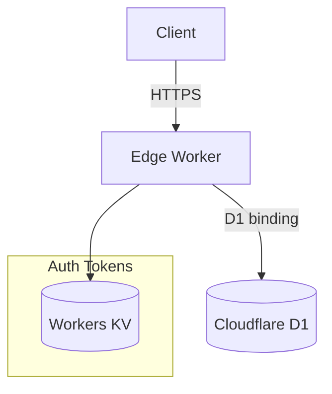

# BulkTrack API — Backend (TypeScript × Hono × Cloudflare Workers)

> **Mission Statement** Build the **fastest, most friction‑less strength‑training log** that *understands* progressive overload and
> uses data‑driven volume management to fuel muscle growth.
>
> This edition is written in **TypeScript 5 + Hono** and runs entirely on **Cloudflare Workers**.

---

## 🧐 What We Make

| Pillar                            | Why it Matters                                                                               | How it Shows Up in the Product                                                                                              |
| --------------------------------- | -------------------------------------------------------------------------------------------- | --------------------------------------------------------------------------------------------------------------------------- |
| **1 📓 Frustration‑free Logging** | A set should be captured in <800 ms, even offline.                                           | *Offline‑first*, single‑tap set duplication, auto‑prefill with last weights/reps, device‑ID onboarding (no account needed). |
| **2 🧮 Volume‑Centric Insights**  | Hypertrophy hinges on *effective volume*. Users need a gut‑level view of "did I do enough?" | Daily/weekly muscle‑volume aggregation, highlight under‑stimulated areas, deload warnings.                                  |
| **3 🤖 AI‑Ready Data Rails**      | Tomorrow's coach learns from your history + recovery. Clean data > fancy models.             | Normalised schema, explicit tempo/rest, deterministic IDs, recommendation log tables.                                       |
| **4 ️ Edge‑native Speed**       | Millisecond APIs worldwide without DevOps drag.                                              | **TypeScript ESM** on CF Edge, single‑regionless SQLite (**D1**), KV token cache.                                           |

---

## 🏗️ Architecture Snapshot



* **Hono** – 3 kB router/middleware stack perfect for Workers.
* **Drizzle** – SQL‑first, type‑safe ORM + migrations.
* **JWT device tokens** verified with `@tsndr/cloudflare-jwt`; refresh & revocation list in KV.
* **OpenAPI 3.0** (`api/openapi.yaml`) drives typed SDK via `openapi-typescript`.

---

## 🔑 Authentication & Onboarding

| Step            | Endpoint                               | Token Type                         | UX                          |
| --------------- | -------------------------------------- | ---------------------------------- | --------------------------- |
| Activate Device | `POST /v1/auth/device` + `X-Device-Id` | *Device Access* + *Device Refresh* | Zero‑tap first launch.      |
| Use API         | protected routes                       | Bearer *Device Access*             | 15 min TTL, auto refresh.   |
| Link Apple ID   | `POST /v1/auth/apple`                  | *User Access* + *User Refresh*     | Optional 1‑tap in Settings. |

Detailed claims live in `docs/auth.md`.

---

## 🗄️ Data Model Essentials

Schema matches Go build; see [`schema.sql`](schema.sql). Drizzle models reside in `src/infrastructure/db/schema/*`.

---

## 📂 Repo Layout — Clean Architecture / DDD

<details>
<summary> Expand full tree</summary>

```text
├── src/
│   ├── domain/                    # Pure business logic (no runtime imports)
│   │   ├── exercise/
│   │   │   ├── entity.ts
│   │   │   ├── repository.ts      # interface / port
│   │   │   └── service.ts
│   │   ├── workout/
│   │   │   ├── entity.ts
│   │   │   └── service.ts
│   │   └── shared/vo/             # Value objects (IDs, units) – Zod‑validated
│   ├── app/                       # Application layer (CQRS)
│   │   ├── command/
│   │   │   ├── exercise/
│   │   │   │   └── createExercise.ts
│   │   │   └── session/
│   │   │       ├── startSession.ts
│   │   │       └── finishSession.ts
│   │   ├── query/
│   │   │   └── exercise/
│   │   │       └── searchExercise.ts
│   │   ├── dto/
│   │   └── errors/
│   ├── interface/                 # Delivery layer
│   │   └── http/
│   │       ├── router.ts          # Hono router composition
│   │       ├── middleware/
│   │       │   ├── auth.ts
│   │       │   ├── cors.ts
│   │       │   └── logging.ts
│   │       └── handlers/
│   │           ├── auth/
│   │           │   ├── device.ts
│   │           │   └── apple.ts
│   │           ├── exercise/
│   │           │   ├── create.ts
│   │           │   └── search.ts
│   │           ├── session/
│   │           │   ├── start.ts
│   │           │   ├── finish.ts
│   │           │   └── sets.ts
│   │           └── dashboard/stats.ts
│   └── infrastructure/
│       ├── db/
│       │   ├── drizzle.ts          # D1 connector + Drizzle client
│       │   └── schema/             # drizzle‑kit generated SQL models
│       ├── kv/tokenStore.ts
│       ├── auth/jwtService.ts
│       └── logging/logger.ts
├── api/
│   └── openapi.yaml
├── docs/
│   ├── auth.md
│   └── architecture.md
├── tests/
│   ├── unit/
│   ├── integration/
│   └── e2e/
├── scripts/
│   ├── migrate.ts                  # Drizzle migrations runner
│   └── gen-openapi-types.sh
├── wrangler.toml
├── tsconfig.json
├── package.json
└── README.md
```
</details>

### Layer Rules

1. **Domain** imports nothing outside `src/domain`. Pure functions & entities.
2. **Application** orchestrates domain objects via commands/queries; depends only on domain ports.
3. **Interface** owns HTTP concerns (Hono handlers), maps HTTP ↔ DTO.
4. **Infrastructure** provides concrete adapters (D1, KV, JWT, Apple verify).

### AI‑Agent Guardrails

* Create files **only in directories above**.
* Tests live beside source as `*.test.ts`.
* Generated artifacts (`dist/`, `.d.ts`) are ignored by git — do **not** commit.

---

## 🛠️ Local Development

```bash
pnpm i                # install deps
pnpm dev              # = wrangler dev --local --experimental-json-config
```

*Hot‑reload*, D1 in‑memory, Vitest watchers.

---

## 🧪 Testing & CI

| Layer    | Tool                                           |
| -------- | ---------------------------------------------- |
| Unit     | **Vitest** + **@hono/testing**                 |
| Contract | **Prism** mock server vs `openapi.yaml`        |
| E2E      | **k6** / **Playwright** hitting `wrangler dev` |

GitHub Actions matrix runs `vitest`, `tsc --noEmit`, ESLint, Drizzle migrations, and contract tests.
